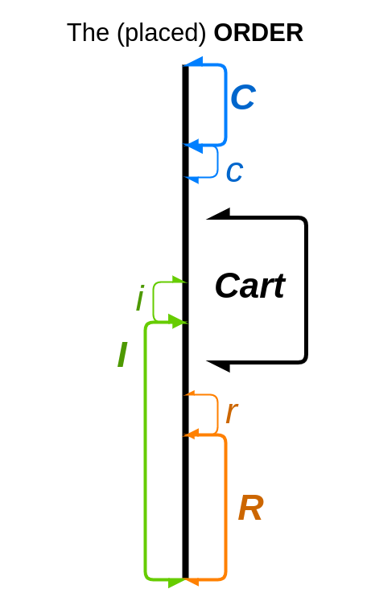
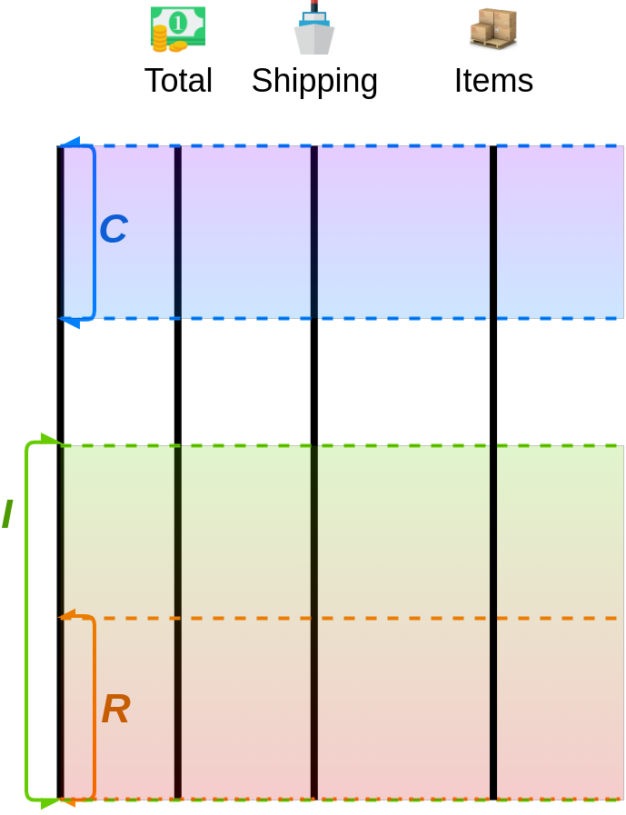
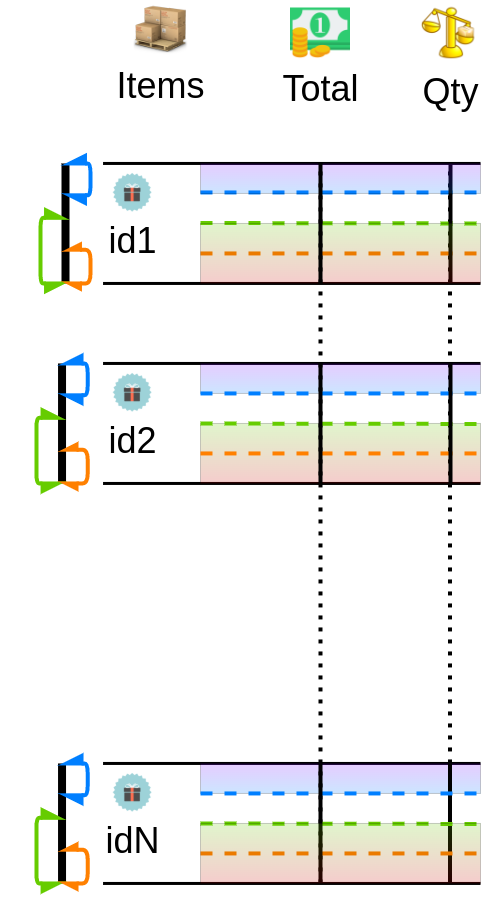

## Order model
The order model is used to calculate amounts for sales documents: invoices, refunds, cancellations. You will see below visual diagrams and calculation formulas that are used in the library.

### Definitions
-  **C** - stands for cancellation-related terms (aka "void transaction")

-  **I** - stands for invoice-related terms (aka "capture transaction")

-  **R** - stands for refund-related terms ("refund transaction" aka "credit memo document")

So, in general, an order can have all 3 types of documents at the same time, and it will look like on the image below:

-  **C****I** - stands for __non-cancelled__ and __non-invoiced__ part of the order.
From the model image we can see, that `CI = Order - C - I`

-  **I****R** - stands for __invoiced__ and __non-refunded__ part of the order.
From the model image we can see, that `IR = I - R`

-  **C****R** - stands for __non-cancelled__ and __non-refunded__ part of the order.
From the model image we can see, that `CR = Order - C - R = CI + IR`

### Invariants
You can refund only the invoiced part of the order.
You can cancel only the non-invoiced part of the order.
You can invoice only the non-cancelled part of the order. For us it means:
- `IR ≥ 0` - can not refund what was not invoiced
- `CI ≥ 0` - can not cancel what was invoiced, and can not invoice what was cancelled

## The Cart
Assuming the current state of order, let's introduce sales operation:
-  **c** - new cancellation
-  **i** - new invoice
-  **r** - new refund

In this case, our order model will look like on the image below:

Here the (expected) **Cart** will always be the part of **CR**. And for each operation we will define the Cart as next:

###  New invoice
Invariant: we can't invoice what was cancelled, which means `i ≤ CI`.
The cart is defined as the accumulated invoices without existing refunds:
`Cart = IR + i = CR - (CI - i)`.
And in this case `Cart ≤ CR`, because of the above invariant `i ≤ CI`.

###  New cancellation
Invariant: we can't cancel what was invoiced, which means `c ≤ CI`.
The cart is defined as everything that wasn't cancelled or refunded:
`Cart = CR - c = IR + (CI - c)`.
And in this case `Cart ≥ IR`, because of the above invariant `c ≤ CI`.

###  New refund
Invariant: we can't refund what was not invoiced, which means `r ≤ IR`.
The cart is defined as everything that wasn't cancelled or refunded:
`Cart = CR - r = CI + (IR - r)`.
And in this case `Cart ≥ CI`, because of the above invariant `r ≤ IR`.

From the introduced cart model, we can easily see, that cart will always be between zero and CR: `0 ≤ Cart ≤ CR`.

## Promotions cancellation (re-calculation)
This library is able to cancel (re-calculate) the promotion, based on the subset of finally acquired items. These calculations are based on the introduced order and cart models. Let's introduce "total" function:
- **T()** - real (probably discounted) amount, excluding shipping costs, aka "total". Cart total - `T(Cart)`, order total - `T(Order)`. Also, we can say about the invoice, refund, cancellation totals: `T(i)`, `T(r)`, `T(c)`.
And it is our goal is to calculate the right amounts (totals) of these sales operations.

From the cart model image (and the cart definition), we can easily see, that:
- `T(i) = T(Cart) - T(IR)`
- `T(c) = T(CR) - T(Cart)`
- `T(r) = T(CR) - T(Cart)`

If your system **can** calculate the right amount for the cart, this library will calculate the right amounts for sales operations using the above formulas. All you need to provide is `T(Cart)`.

If your system **can not** calculate right amount for the cart, you can use the "spreading discount" calculation, provided by this library. In this case, the discount is spread proportionally based on "subtotal" function:
- **ST()** - the sum of totals of the items, aka "subtotal". Cart subtotal - `ST(Cart)`, order subtotal - `ST(Order)`.

The proportion is next: `ST(Cart) / ST(Order) = T(Cart) / T(Order)`. And here we get "proportional" cart total: `T(Cart) = T(Order) * ST(Cart) / ST(Order)`. This proportional discount calculation is implemented in [cart.order](./cart.md#cartorder)

## Interface segregation
When we say about invoiced, refunded and cancelled parts of an order, we may talk about the total amount or shipping amount or items independently (segregation) that belong to these parts of orders. We can also calculate total, shipping and items, that belong to IR, CI, CR. All above formulas should be valid for each segregated interface:

[Documents](./documents.md) functions will help you to make this aggregation for all invoice documents, all refund documents, and all cancellation documents to calculate I, R, C. For IR, CI and CR you can use [order.sales](./order.md#ordersalesshipping) functions. Having all this data, we can also calculate for each item - how many items (quantity) and what amount per item belongs to each part of order (invoiced, refunded, cancelled, IR, CI, CR). All above formulas should be valid for each separate item (segregated by quantity and total interfaces)

To sum up: with this library, you can calculate different scopes of order (invoiced, refunded, cancelled, IR, CI, CR) and each scope can have segregated interfaces: total, shipping, items quantity, items total as well as you can calculate these scopes for each separate item independently.

### Read more
- [README home](../README.md)
- [Interfaces](./interfaces.md)
- [Business scenarios](./sales/business.md)
- [Basics](./basics.md) (low-order functions)
- [Documents](./documents.md)
- [Invariants](./invariants.md)
- [Cart](./cart.md)
- [Order](./order.md) (high-order functions)
- [Injectable API](./injectable.md)